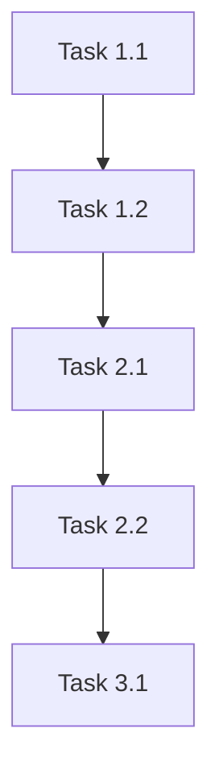

# Product Requirements Document: {PROJECT_NAME}

## Metadata

| Field | Value |
|-------|-------|
| **Created** | {TIMESTAMP} |
| **Last Updated** | {TIMESTAMP} |
| **Status** | draft / in-progress / implemented |
| **Version** | 1.0 |
| **Author** | Claude + {USER} |

---

## 1. Executive Summary

{2-3 sentences describing the problem and proposed solution. This should be understandable by anyone in 30 seconds.}

---

## 2. Problem Statement

### Pain Points

- {Specific pain point 1 - who experiences it, how often, impact}
- {Specific pain point 2}
- {Specific pain point 3}

### Current State

{How do users currently solve this problem? What workarounds exist? Why are they insufficient?}

### Why Now?

{What makes this problem worth solving now? Market timing, user demand, technical feasibility changes?}

---

## 3. Success Metrics (SMART)

How we'll know this project succeeded:

- [ ] **{Metric 1}**: {Specific, Measurable target} by {timeframe}
- [ ] **{Metric 2}**: {Specific, Measurable target} by {timeframe}
- [ ] **{Metric 3}**: {Specific, Measurable target} by {timeframe}

---

## 4. User Stories

### Primary Persona: {PERSONA_NAME}

> {Brief description: role, technical level, key characteristics}

#### Core User Stories

- [ ] **US-001**: As a {user type}, I want {goal} so that {benefit}
  - **Acceptance Criteria**:
    - [ ] {Testable criterion 1}
    - [ ] {Testable criterion 2}
  - **Priority**: P0

- [ ] **US-002**: As a {user type}, I want {goal} so that {benefit}
  - **Acceptance Criteria**:
    - [ ] {Testable criterion 1}
    - [ ] {Testable criterion 2}
  - **Priority**: P1

- [ ] **US-003**: As a {user type}, I want {goal} so that {benefit}
  - **Acceptance Criteria**:
    - [ ] {Testable criterion 1}
  - **Priority**: P1

{Add more user stories as needed}

---

## 5. Functional Requirements

### Core Features

- [ ] **FR-001**: {Feature description}
  - Priority: P0
  - Dependencies: {None / FR-XXX}
  - Notes: {Implementation considerations}

- [ ] **FR-002**: {Feature description}
  - Priority: P0
  - Dependencies: {None / FR-XXX}

- [ ] **FR-003**: {Feature description}
  - Priority: P1
  - Dependencies: {FR-001}

{Add more requirements as needed}

### Out of Scope (Explicit)

These items are explicitly NOT part of this project:

- {Feature/capability 1} — Reason: {why excluded}
- {Feature/capability 2} — Reason: {why excluded}
- {Feature/capability 3} — Future phase consideration

---

## 6. Technical Specifications

### Tech Stack

| Layer | Technology | Notes |
|-------|------------|-------|
| Frontend | {e.g., React, Vue} | {version, key libs} |
| Backend | {e.g., Node.js, Python} | {framework} |
| Database | {e.g., PostgreSQL, MongoDB} | {hosted where} |
| Deployment | {e.g., Vercel, AWS} | {environment} |

### Architecture Overview

{High-level architecture description. Include diagram if complex.}

```
{ASCII diagram or reference to architecture diagram}
```

### Data Models

```
{Key entity definitions}

Example:
User {
  id: UUID (PK)
  email: string (unique)
  name: string
  created_at: timestamp
}
```

### API Contracts (if applicable)

```
{Key endpoint definitions}

Example:
POST /api/users
  Request: { email: string, name: string }
  Response: { id: string, email: string, name: string }
  Errors: 400 (validation), 409 (duplicate)
```

---

## 7. Implementation Phases

### Phase 1: {PHASE_NAME} (Foundation)

**Goal**: {What this phase achieves}

- [ ] **Task 1.1**: {Specific, actionable task description}
- [ ] **Task 1.2**: {Specific, actionable task description}
- [ ] **Task 1.3**: {Specific, actionable task description}
- [ ] **Task 1.4**: {Specific, actionable task description}

**Phase 1 Verification**: {How to verify this phase is complete}

---

### Phase 2: {PHASE_NAME} (Core Features)

**Goal**: {What this phase achieves}

- [ ] **Task 2.1**: {Specific, actionable task description}
- [ ] **Task 2.2**: {Specific, actionable task description}
- [ ] **Task 2.3**: {Specific, actionable task description}
- [ ] **Task 2.4**: {Specific, actionable task description}
- [ ] **Task 2.5**: {Specific, actionable task description}

**Phase 2 Verification**: {How to verify this phase is complete}

---

### Phase 3: {PHASE_NAME} (Polish & Launch)

**Goal**: {What this phase achieves}

- [ ] **Task 3.1**: {Specific, actionable task description}
- [ ] **Task 3.2**: {Specific, actionable task description}
- [ ] **Task 3.3**: {Specific, actionable task description}

**Phase 3 Verification**: {How to verify this phase is complete}

---

## 8. Testing Strategy

### Unit Tests

- [ ] {Component/Module}: {What to test}
- [ ] {Component/Module}: {What to test}

### Integration Tests

- [ ] {Flow/Feature}: {What to test}
- [ ] {Flow/Feature}: {What to test}

### E2E Tests

- [ ] {User scenario}: {What to test}
- [ ] {User scenario}: {What to test}

### Test Commands

```bash
# Run all tests
{test command}

# Run specific test suite
{test command}

# Run with coverage
{test command}
```

---

## 9. Non-Functional Requirements

### Performance

- Response time: {target, e.g., < 200ms for API calls}
- Throughput: {target, e.g., 1000 req/sec}
- Concurrent users: {target}

### Security

- [ ] {Security requirement 1, e.g., HTTPS only}
- [ ] {Security requirement 2, e.g., Input validation}
- [ ] {Security requirement 3, e.g., Auth mechanism}

### Other

- Accessibility: {requirements, e.g., WCAG 2.1 AA}
- Browser support: {targets}
- Mobile support: {requirements}

---

## 10. Risk Assessment

| Risk | Likelihood | Impact | Mitigation |
|------|------------|--------|------------|
| {Risk 1} | High/Med/Low | High/Med/Low | {Mitigation strategy} |
| {Risk 2} | High/Med/Low | High/Med/Low | {Mitigation strategy} |
| {Risk 3} | High/Med/Low | High/Med/Low | {Mitigation strategy} |

---

## 11. Dependencies

### External Dependencies

- {External service/API 1}: {What we need from it}
- {External service/API 2}: {What we need from it}

### Internal Dependencies



---

## Change Log

| Date | Version | Changes | Author |
|------|---------|---------|--------|
| {DATE} | 1.0 | Initial PRD | Claude |

---

## Appendix

### Glossary

- **{Term 1}**: {Definition}
- **{Term 2}**: {Definition}

### References

- {Link to design docs}
- {Link to related PRDs}
- {Link to external resources}
